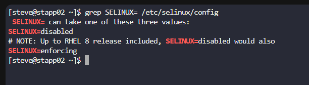

## Day 5: SELinux Installation and Configuration

| Task                                                                                                                                                                                                                                                                                                                                                                                                                     | Solution                                                                                                                                                                                                                                                                                                                                                                                                                                                                                                                                                                                                                                                                                                                                                                     |
| ------------------------------------------------------------------------------------------------------------------------------------------------------------------------------------------------------------------------------------------------------------------------------------------------------------------------------------------------------------------------------------------------------------------------ | ---------------------------------------------------------------------------------------------------------------------------------------------------------------------------------------------------------------------------------------------------------------------------------------------------------------------------------------------------------------------------------------------------------------------------------------------------------------------------------------------------------------------------------------------------------------------------------------------------------------------------------------------------------------------------------------------------------------------------------------------------------------------------- |
| Following a security audit, the xFusionCorp Industries security team has opted to enhance application and server security with SELinux. For App Server 2 in the Stratos Datacenter: install required SELinux packages, and permanently disable SELinux for now (the server will be rebooted as part of scheduled maintenance tonight). Disregard current runtime status; the final post-reboot state should be disabled. | ✅ Step 1: Install SELinux packages<br><br>RHEL/CentOS/Amazon Linux:<br><pre>sudo yum install -y selinux-policy selinux-policy-targeted</pre>Debian/Ubuntu:<br><pre>sudo apt-get install -y selinux selinux-utils selinux-policy-default</pre><br><br>🔧 Step 2: Permanently disable SELinux (so it is disabled after reboot)<br><pre>sudo vi /etc/selinux/config</pre>Change the line:<br><pre>SELINUX=enforcing</pre>to:<br><pre>SELINUX=disabled</pre>Save and exit.<br><br>🚫 Step 3: No immediate reboot needed (scheduled maintenance will reboot tonight).<br><br>📌 Verification:<br><pre>grep SELINUX= /etc/selinux/config</pre><br>Ignore runtime tools like <code>getenforce</code> for now; they reflect the current session, not the post-reboot configuration. |

---

### Result (example)

After the steps are applied and the scheduled reboot occurs, you should see the configuration show SELinux disabled. Add the screenshot image `output-grep-SELINUX.png` to this folder to display the captured output.



If an image is not available, the equivalent command output should look like:

```bash
$ grep SELINUX= /etc/selinux/config
SELINUX=disabled
```
